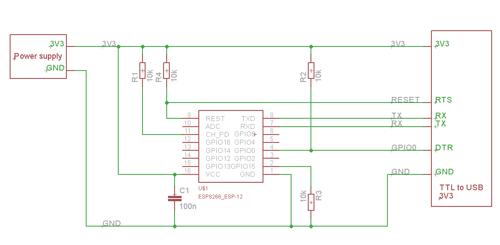
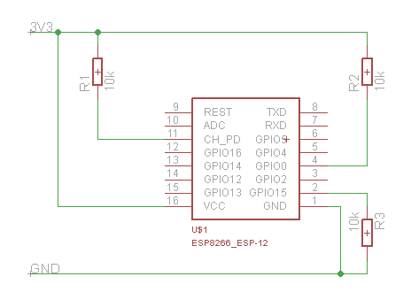

Boards
======

Generic ESP8266
---------------

These modules come in different form factors and pinouts. See the page at ESP8266 community wiki for more info: `ESP8266 Module Family <http://www.esp8266.com/wiki/doku.php?id=esp8266-module-family>`__.

Usually these modules have no bootstapping resistors on board, insufficient decoupling capacitors, no voltage regulator, no reset circuit, and no USB-serial adapter. This makes using them somewhat tricky, compared to development boards which add these features.

In order to use these modules, make sure to observe the following:

-  **Provide sufficient power to the module.** For stable use of the ESP8266 a power supply with 3.3V and >= 250mA is required. Using the power available from USB to Serial adapter is not recommended, these adapters typically do not supply enough current to run ESP8266 reliably in every situation. An external supply or regulator alongwith filtering capacitors is preferred.

-  **Connect bootstapping resistors** to GPIO0, GPIO2, GPIO15 according to the schematics below.

-  **Put ESP8266 into bootloader mode** before uploading code.

Serial Adapter
--------------

There are many different USB to Serial adapters / boards. To be able to put ESP8266 into bootloader mode using serial handshaking lines, you need the adapter which breaks out RTS and DTR outputs. CTS and DSR are not useful for upload (they are inputs). Make sure the adapter can work with 3.3V IO voltage: it should have a jumper or a switch to select between 5V and 3.3V, or be marked as 3.3V only.

Adapters based around the following ICs should work:

-  FT232RL
-  CP2102
-  CH340G

PL2303-based adapters are known not to work on Mac OS X. See https://github.com/igrr/esptool-ck/issues/9 for more info.

Minimal Hardware Setup for Bootloading and Usage
------------------------------------------------

+-----------------+------------+------------------+
| PIN             | Resistor   | Serial Adapter   |
+=================+============+==================+
| VCC             |            | VCC (3.3V)       |
+-----------------+------------+------------------+
| GND             |            | GND              |
+-----------------+------------+------------------+
| TX or GPIO2\*   |            | RX               |
+-----------------+------------+------------------+
| RX              |            | TX               |
+-----------------+------------+------------------+
| GPIO0           | PullUp     | DTR              |
+-----------------+------------+------------------+
| Reset\*         | PullUp     | RTS              |
+-----------------+------------+------------------+
| GPIO15\*        | PullDown   |                  |
+-----------------+------------+------------------+
| CH\_PD          | PullUp     |                  |
+-----------------+------------+------------------+

-  Note
-  GPIO15 is also named MTDO
-  Reset is also named RSBT or REST (adding PullUp improves the
   stability of the module)
-  GPIO2 is alternative TX for the boot loader mode
-  **Directly connecting a pin to VCC or GND is not a substitute for a
   PullUp or PullDown resistor, doing this can break upload management
   and the serial console, instability has also been noted in some
   cases.**

ESP to Serial
-------------

   ESP to Serial

Minimal Hardware Setup for Bootloading only
~~~~~~~~~~~~~~~~~~~~~~~~~~~~~~~~~~~~~~~~~~~

ESPxx Hardware

+---------------+------------+------------------+
| PIN           | Resistor   | Serial Adapter   |
+===============+============+==================+
| VCC           |            | VCC (3.3V)       |
+---------------+------------+------------------+
| GND           |            | GND              |
+---------------+------------+------------------+
| TX or GPIO2   |            | RX               |
+---------------+------------+------------------+
| RX            |            | TX               |
+---------------+------------+------------------+
| GPIO0         |            | GND              |
+---------------+------------+------------------+
| Reset         |            | RTS\*            |
+---------------+------------+------------------+
| GPIO15        | PullDown   |                  |
+---------------+------------+------------------+
| CH\_PD        | PullUp     |                  |
+---------------+------------+------------------+

-  Note
-  if no RTS is used a manual power toggle is needed

Minimal Hardware Setup for Running only
~~~~~~~~~~~~~~~~~~~~~~~~~~~~~~~~~~~~~~~

ESPxx Hardware

+----------+------------+----------------+
| PIN      | Resistor   | Power supply   |
+==========+============+================+
| VCC      |            | VCC (3.3V)     |
+----------+------------+----------------+
| GND      |            | GND            |
+----------+------------+----------------+
| GPIO0    | PullUp     |                |
+----------+------------+----------------+
| GPIO15   | PullDown   |                |
+----------+------------+----------------+
| CH\_PD   | PullUp     |                |
+----------+------------+----------------+

Minimal
-------

   ESP min

Improved Stability
------------------

.. figure:: ESP_improved_stability.png
   :alt: ESP improved stability

   ESP improved stability

Boot Messages and Modes
-----------------------

The ESP module checks at every boot the Pins 0, 2 and 15. based on them its boots in different modes:

+----------+---------+---------+------------------------------------+
| GPIO15   | GPIO0   | GPIO2   | Mode                               |
+==========+=========+=========+====================================+
| 0V       | 0V      | 3.3V    | Uart Bootloader                    |
+----------+---------+---------+------------------------------------+
| 0V       | 3.3V    | 3.3V    | Boot sketch (SPI flash)            |
+----------+---------+---------+------------------------------------+
| 3.3V     | x       | x       | SDIO mode (not used for Arduino)   |
+----------+---------+---------+------------------------------------+

at startup the ESP prints out the current boot mode example:

::

    rst cause:2, boot mode:(3,6)

note: - GPIO2 is used as TX output and the internal Pullup is enabled on boot.

rst cause
~~~~~~~~~

+----------+------------------+
| Number   | Description      |
+==========+==================+
| 0        | unknown          |
+----------+------------------+
| 1        | normal boot      |
+----------+------------------+
| 2        | reset pin        |
+----------+------------------+
| 3        | software reset   |
+----------+------------------+
| 4        | watchdog reset   |
+----------+------------------+

boot mode
~~~~~~~~~

the first value respects the pin setup of the Pins 0, 2 and 15.

+----------+----------+---------+---------+-------------+
| Number   | GPIO15   | GPIO0   | GPIO2   | Mode        |
+==========+==========+=========+=========+=============+
| 0        | 0V       | 0V      | 0V      | Not valid   |
+----------+----------+---------+---------+-------------+
| 1        | 0V       | 0V      | 3.3V    | Uart        |
+----------+----------+---------+---------+-------------+
| 2        | 0V       | 3.3V    | 0V      | Not valid   |
+----------+----------+---------+---------+-------------+
| 3        | 0V       | 3.3V    | 3.3V    | Flash       |
+----------+----------+---------+---------+-------------+
| 4        | 3.3V     | 0V      | 0V      | SDIO        |
+----------+----------+---------+---------+-------------+
| 5        | 3.3V     | 0V      | 3.3V    | SDIO        |
+----------+----------+---------+---------+-------------+
| 6        | 3.3V     | 3.3V    | 0V      | SDIO        |
+----------+----------+---------+---------+-------------+
| 7        | 3.3V     | 3.3V    | 3.3V    | SDIO        |
+----------+----------+---------+---------+-------------+

note: - number = ((GPIO15 << 2) \| (GPIO0 << 1) \| GPIO2);

Generic ESP8285
---------------

ESP8285 (`datasheet <http://www.espressif.com/sites/default/files/0a-esp8285_datasheet_en_v1.0_20160422.pdf>`__) is a multi-chip package which contains ESP8266 and 1MB flash. All points related to bootstrapping resistors and recommended circuits listed above apply to ESP8285 as well.

Note that since ESP8285 has SPI flash memory internally connected in DOUT mode, pins 9 and 10 may be used as GPIO / I2C / PWM pins.

Adafruit Feather HUZZAH
-----------------------

The Adafruit Feather HUZZAH ESP8266 is an Arduino-compatible Wi-Fi development board powered by Ai-Thinker's ESP-12S, clocked at 80 MHz at 3.3V logic. A high-quality SiLabs CP2104 USB-Serial chip is included so that you can upload code at a blistering 921600 baud for fast development time. It also has auto-reset so no noodling with pins and reset button pressings. A 3.7V Lithium polymer battery connector is included, making it ideal for portable projects. The Adafruit Feather HUZZAH ESP8266 will automatically recharge a connected battery when USB power is available.

Product page: https://www.adafruit.com/product/2821

NodeMCU
-------

This module is sold under many names for around $6.50 on AliExpress and it's one of the cheapest, fully integrated ESP8266 solutions.

It's an open hardware design with an ESP-12E core and 4 MB of SPI flash.

According to the manufacturer, "with a micro USB cable, you can connect NodeMCU devkit to your laptop and flash it without any trouble". This is more or less true: the board comes with a CP2102 onboard USB to serial adapter which just works, well, the majority of the time. Sometimes flashing fails and you have to reset the board by holding down FLASH +
RST, then releasing FLASH, then releasing RST. This forces the CP2102 device to power cycle and to be re-numbered by Linux.

The board also features a NCP1117 voltage regulator, a blue LED on GPIO16 and a 220k/100k Ohm voltage divider on the ADC input pin.
The ESP-12E usually has a led connected on GPIO2.

Full pinout and PDF schematics can be found `here <https://github.com/nodemcu/nodemcu-devkit-v1.0>`__

LOLIN(WEMOS) D1 mini
--------------------

Product page: https://www.wemos.cc/

